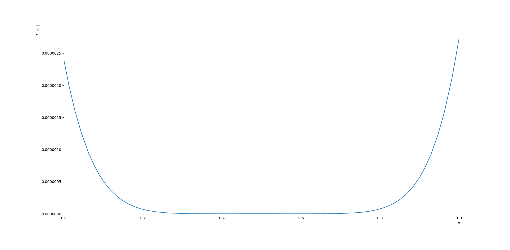
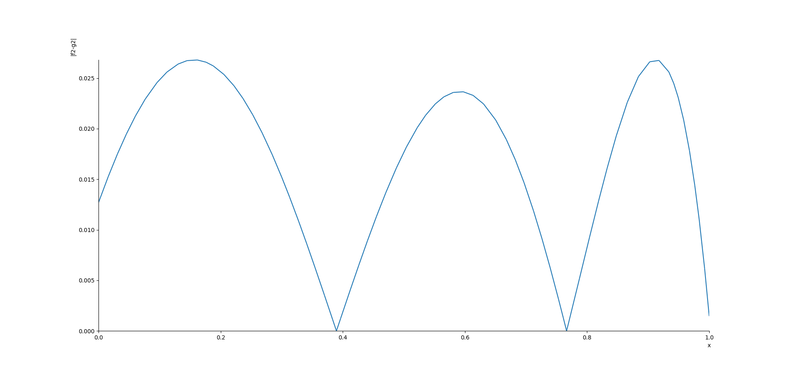
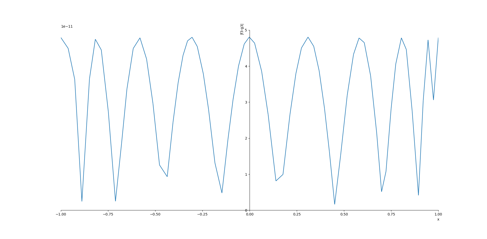
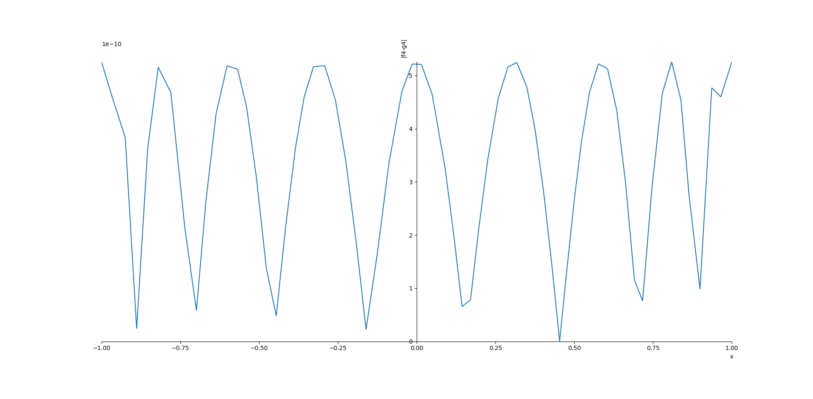

# Chebyshev [](https://travis-ci.org/mlazaric/Chebyshev)

## Installation

```
pip install -r requirements.txt
```

## Results

### 1st function: `exp(x)`

Coefficients for `exp(x)` on the `[0, 1]` interval:

```
1.0000024044009956   x^6 +
0.9999666248595308   x^5 +
0.5001979896785546   x^4 + 
0.1660170723968879   x^3 + 
0.04293544975781584  x^2 +
0.006869671961250533 x   +
0.0022898906537501783
```

Maximum error on that interval: `2.724750259641695e-06`



### 2nd function: `ln(1 + x)`

Coefficients for `ln(1 + x)` on the `[0, 1]` interval:

```
0.012692400008913071 x^6 +
1.1670684814453125   x^5 +
-0.8604888916015625  x^4 +
-0.7628885904947916  x^3 +
1.2359619140625      x^2 +
1.684326171875       x   +
-1.7820638020833333
```

Maximum error on that interval: `0.026814743150640807`



### 3rd function: `sin(x) / x`

Coefficients for `sin(x) / x` on the `[-1, 1]` interval:

```
0.9999999999519255      x^8 +
0.0                     x^7 +
-0.16666666426123591    x^6 +
0.0                     x^5 +
0.008333314069456322    x^4 +
0.0                     x^3 +
-0.00019835866408658446 x^2 +
0.0                     x   +
2.693759757656585e-06   
```

Maximum error on that interval: `4.807454434541114e-11`



### 4th function: `cos(x)`

Coefficients for `cos(x)` on the `[-1, 1]` interval:

```
0.9999999994728757     x^8 +
0.0                    x^7 +
-0.49999997362171783   x^6 +
0.0                    x^5 +
0.04166645537534186    x^4 +
0.0                    x^3 +
-0.0013882960343185485 x^2 +
0.0                    x   +
2.412120108317053e-05  
```

Maximum error on that interval: `5.271243441740125e-10`

