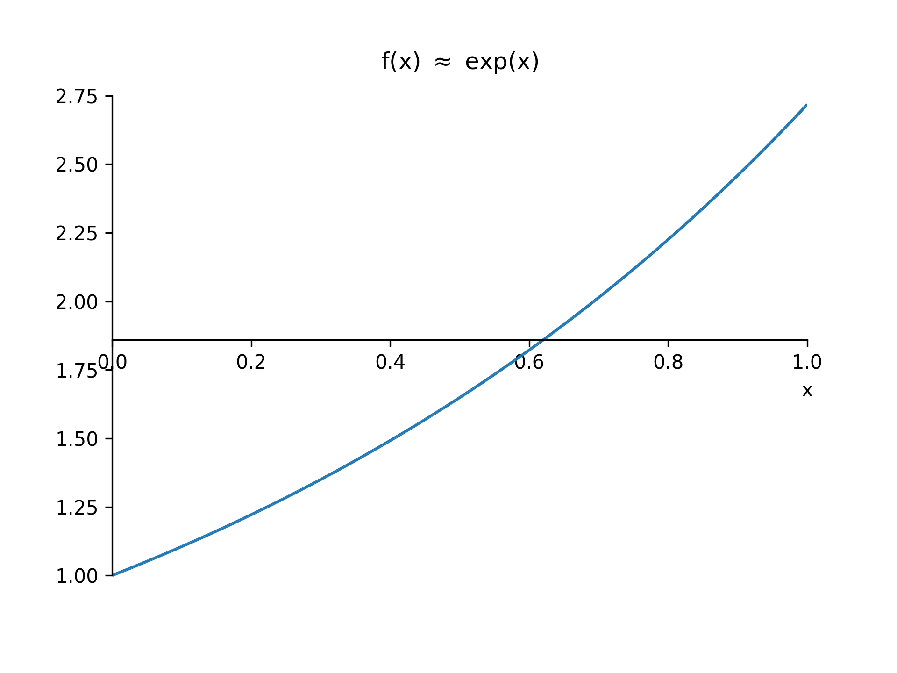
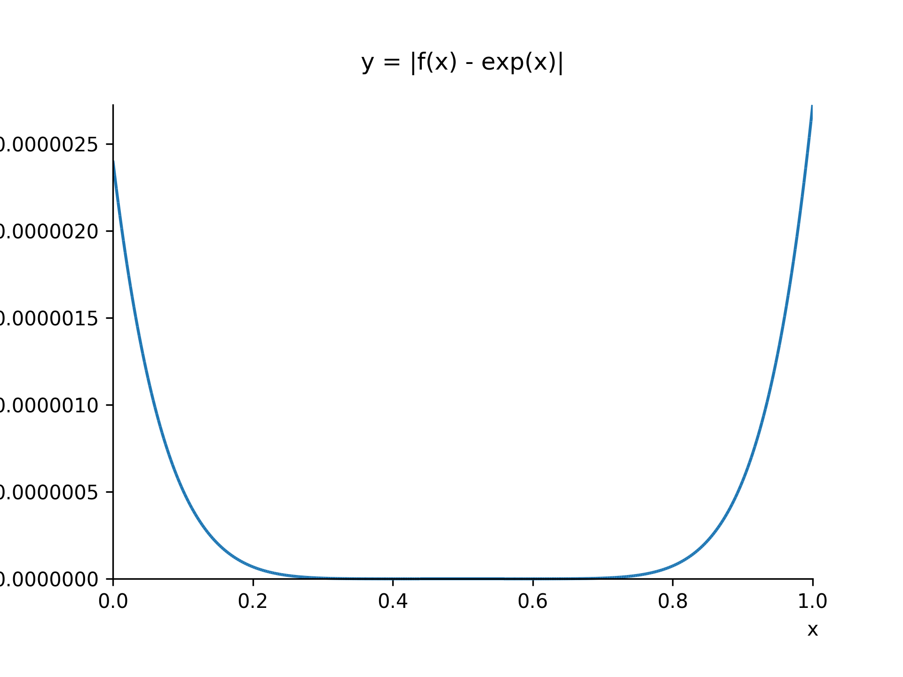
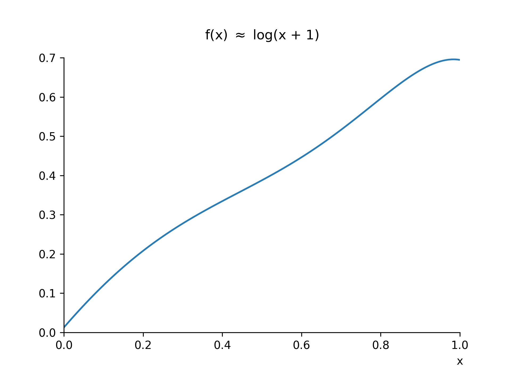
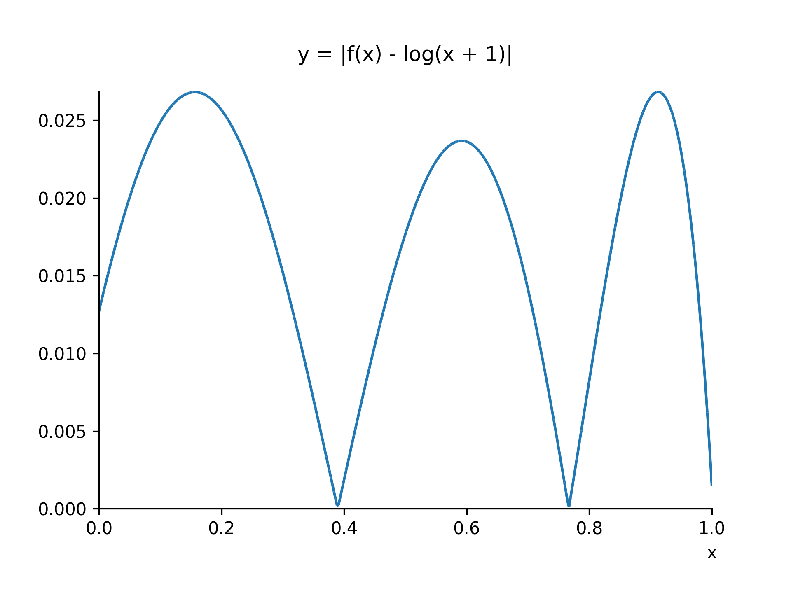
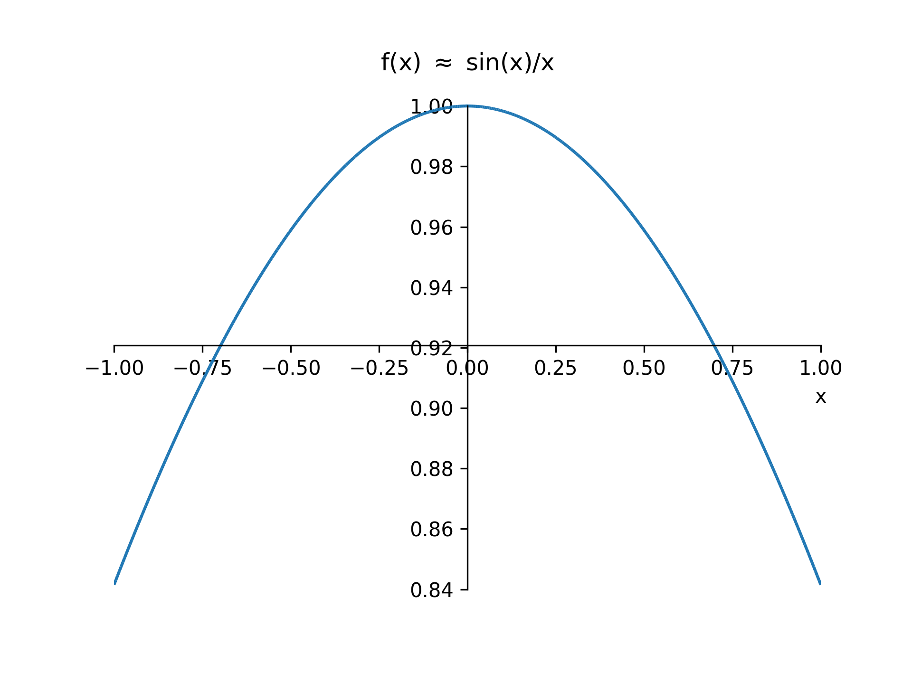
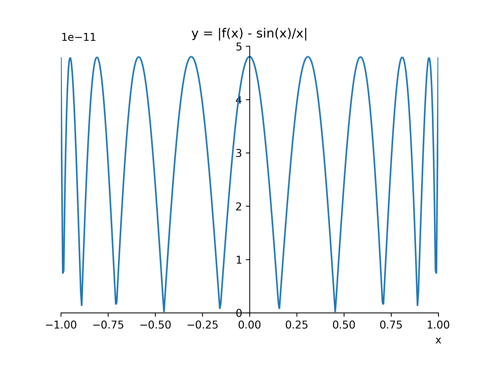
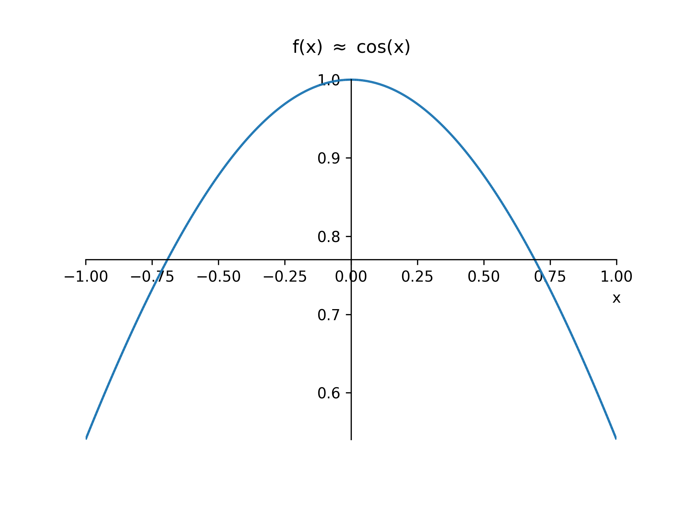
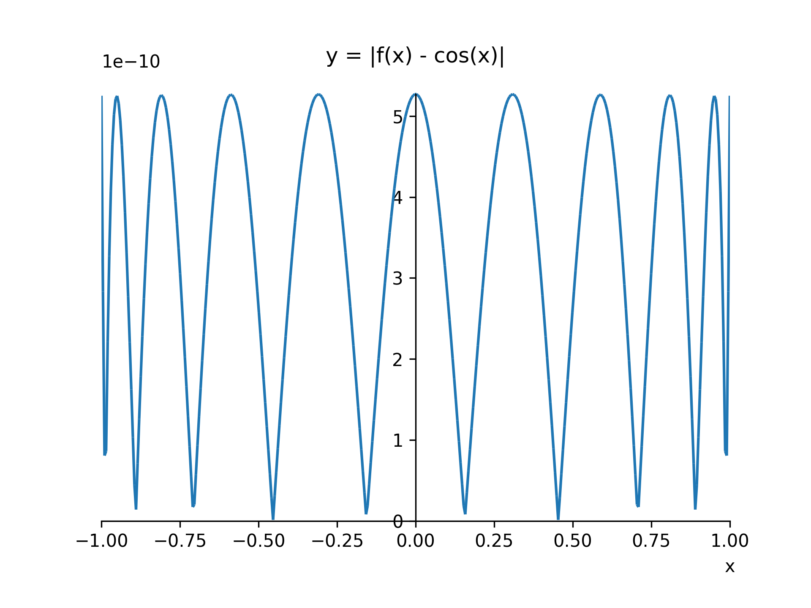

# Chebyshev [](https://zenodo.org/badge/latestdoi/160536357)

## Introduction

A simple python module for approximating any `sympy` expression 
using the Taylor series and Chebyshev polynomials.

It was created as a project for the [DisCont mathematics 2](https://www.fer.unizg.hr/en/course/dismat2)
course at the Faculty of Electrical Engineering and Computing, University of Zagreb.

## Installation

Requires at least `python 3.6`.

```
pip install -r requirements.txt
```

## Submodules

The functionality is divided into two submodules:

 * `chebyshev.polynomial` which is used for computing and storing Chebyshev polynomials, as well as
 some other simple polynomial manipulation.
 * `chebyshev.approximation` which is used for approximating any `sympy` expression using the Taylor
 series and Chebyshev polynomials.

## Approximated Functions

* [`exp(x)`](#expx)
* [`log(x + 1)`](#logx--1)
* [`sin(x)/x`](#sinxx)
* [`cos(x)`](#cosx)


## `exp(x)`

Coefficients for `exp(x)` on the `[0, 1]` interval:
     
|        Coefficient        |  Term  |
|---------------------------|--------|
| `+0.00228989065375017828` | <code>x<sup>6</sup></code> |
| `+0.00686967196125053310` | <code>x<sup>5</sup></code> |
| `+0.04293544975781583839` | <code>x<sup>4</sup></code> |
| `+0.16601707239688789919` | <code>x<sup>3</sup></code> |
| `+0.50019798967855455540` | <code>x<sup>2</sup></code> |
| `+0.99996662485953080601` | <code>x</code> |
| `+1.00000240440099563700` | <code>1</code> |


Maximum error on that interval is `2.724750259197606e-06`



## `log(x + 1)`

Coefficients for `log(x + 1)` on the `[0, 1]` interval:
     
|        Coefficient        |  Term  |
|---------------------------|--------|
| `-1.78206380208333333330` | <code>x<sup>6</sup></code> |
| `+1.68432617187500000000` | <code>x<sup>5</sup></code> |
| `+1.23596191406250000000` | <code>x<sup>4</sup></code> |
| `-0.76288859049479166667` | <code>x<sup>3</sup></code> |
| `-0.86048889160156250000` | <code>x<sup>2</sup></code> |
| `+1.16706848144531250000` | <code>x</code> |
| `+0.01269240000891307044` | <code>1</code> |


Maximum error on that interval is `0.026814743150641585`



## `sin(x)/x`

Coefficients for `sin(x)/x` on the `[-1, 1]` interval:
     
|        Coefficient        |  Term  |
|---------------------------|--------|
| `+0.00000269375975765659` | <code>x<sup>8</sup></code> |
| `-0.00019835866408658445` | <code>x<sup>6</sup></code> |
| `+0.00833331406945632250` | <code>x<sup>4</sup></code> |
| `-0.16666666426123592319` | <code>x<sup>2</sup></code> |
| `+0.99999999995192540491` | <code>1</code> |


Maximum error on that interval is `4.807454434541114e-11`



## `cos(x)`

Coefficients for `cos(x)` on the `[-1, 1]` interval:
     
|        Coefficient        |  Term  |
|---------------------------|--------|
| `+0.00002412120108317053` | <code>x<sup>8</sup></code> |
| `-0.00138829603431854838` | <code>x<sup>6</sup></code> |
| `+0.04166645537534185744` | <code>x<sup>4</sup></code> |
| `-0.49999997362171781040` | <code>x<sup>2</sup></code> |
| `+0.99999999947287565593` | <code>1</code> |


Maximum error on that interval is `5.271243441740125e-10`




## Related Projects 

 * [ChebyshevPolyfit](https://github.com/LMesaric/ChebyshevPolyfit) by [@LMesaric](https://github.com/LMesaric).
